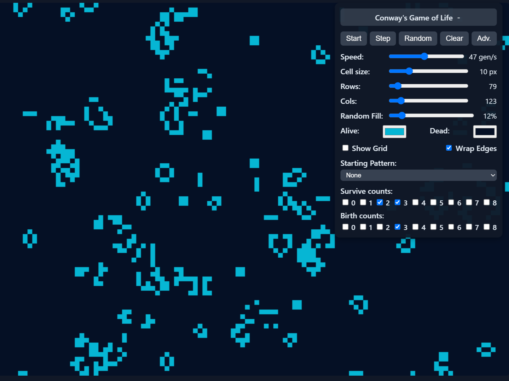

# Conway's Game of Life

  

      
       
      <a href="https://jo56.github.io/conways-game-of-life" target="_blank">
          <b>https://jo56.github.io/conways-game-of-life</b>
      </a>
  

 

Simple visual tool for running Conway's Game of Life and other types of cellular automata simulations. Conditions such as grid size and survival/birth counts can be adjusted for additional flexibility. 

### Quick Start

1. `npm install`  
2. `npm run dev`

This project uses **Vite + React + TypeScript**. The primary app is `src/App.tsx` (default export component).  

The canvas is responsive; use the controls to start/stop, step, randomize, and clear the simulation.

### Warning: 

This program may cause rapidly flashing light effects depending on how the settings are configured. 

These effects become rapid at high speeds, so it might be worth testing on slower speeds first if you are concerned. 

The effect can be easier to induce depending on the current count settings, such as when selecting the same birth and survive count values simultaneously

### Controls

You can get rid of the settings window by dragging it offscreen.  

**Shift** toggles menu visibility. Pressing **Shift** once will cause the toolbox to disappear. Pressing **Shift** again will cause it to reappear where your mouse is.

Press **Space** to toggle Start/Stop.
